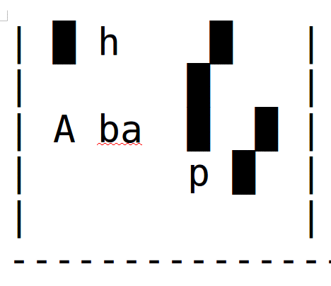

# Overlaid Messages
This script will take in a message and hide it across multiple sheets.  Print those sheets on transparent paper and when they are overlaid on top of each other, you will see your combined message!



## Usage
    python overlaidMessages.py [-h] [--padding PADDING] [--message MESSAGE] [--sheets SHEETS]

This will print out the sheets in the terminal. Copy the text from the terminal into your favourite word processor.  Set the font to a [monospaced font](https://en.wikipedia.org/wiki/List_of_monospaced_typefaces) and print it out on transparent paper

Once they are printed out, cut them out and work them into a game or scavenger hunt.

## Options
```
optional arguments:
  -h, --help         show this help message and exit
  --padding PADDING  How much extra character padding is added to the longest word
  --message MESSAGE  The message to hide amongst the sheets
  --sheets SHEETS    Number of pages to create
```
